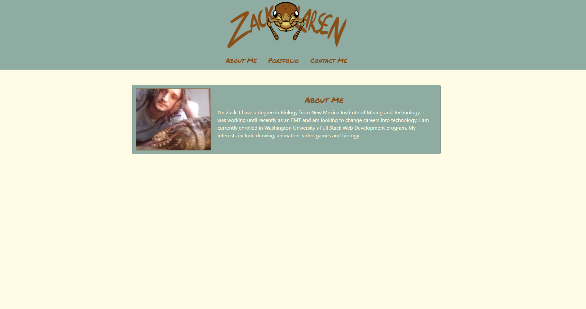

# homework2.1
# homework2
Homework 2 - Portfolio Website

Constructed a portfolio website using Bootstrap including an About Me, Contact Me, and Portfolio section. Obviously in its current form the portfolio section is constructed of placeholder images. I did this under the assumption you would want me to show them rearrange responsively.

Application deployed at: https://myrmoxenus.github.io/homework2.1/
For some reason when I updated my initial Homework 2 repository with my current website design, it would upload an abberant hybrid of my previous attempts with my new attempts. Because of this, I moved it to a homework2.1 repository. Seemed to fix the problem.

If you'd like to see my previous git commit history, the previous repository is located at https://github.com/Myrmoxenus/homework2.

Screenshot: 

